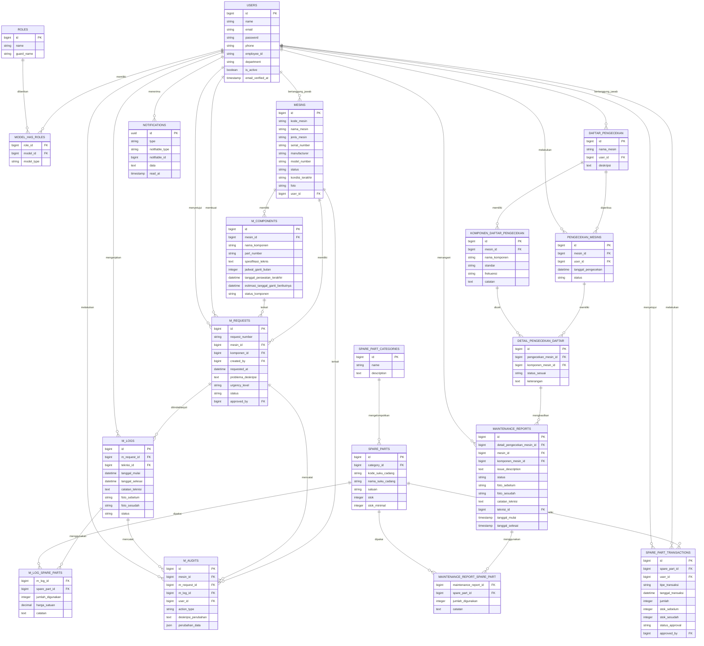

# Entity Relationship Diagram (ERD) Sistem

Dokumen ini berisi rancangan ERD sistem pengecekan dan maintenance aset operasional. ERD disusun berdasarkan struktur tabel utama pada aplikasi, relasi model Laravel, dan kebutuhan proses bisnis sistem.

## Entitas Utama

| Entitas | Keterangan |
| --- | --- |
| `users` | Menyimpan data pengguna sistem. |
| `roles` | Menyimpan data peran pengguna. |
| `model_has_roles` | Tabel penghubung antara pengguna dan role. |
| `mesins` | Menyimpan data master mesin/aset operasional. |
| `m_components` | Menyimpan data komponen dari master mesin/aset. |
| `daftar_pengecekan` | Menyimpan daftar aset atau item yang harus dilakukan pengecekan. |
| `komponen_daftar_pengecekan` | Menyimpan komponen checklist, standar, dan frekuensi pengecekan. |
| `pengecekan_mesins` | Menyimpan data utama aktivitas pengecekan. |
| `detail_pengecekan_daftar` | Menyimpan detail hasil pengecekan setiap komponen. |
| `maintenance_reports` | Menyimpan laporan maintenance yang dihasilkan dari hasil pengecekan tidak sesuai. |
| `m_requests` | Menyimpan permintaan maintenance terhadap mesin/aset. |
| `m_logs` | Menyimpan laporan perawatan atau tindak lanjut maintenance oleh teknisi. |
| `spare_part_categories` | Menyimpan kategori suku cadang. |
| `spare_parts` | Menyimpan data suku cadang. |
| `spare_part_transactions` | Menyimpan histori transaksi stok suku cadang. |
| `maintenance_report_spare_part` | Tabel penghubung penggunaan suku cadang pada laporan maintenance. |
| `m_log_spare_parts` | Tabel penghubung penggunaan suku cadang pada log maintenance. |
| `m_audits` | Menyimpan audit trail aktivitas maintenance. |
| `notifications` | Menyimpan notifikasi sistem. |

## Relasi Utama

| Relasi | Kardinalitas |
| --- | --- |
| `users` ke `roles` | Many-to-many melalui `model_has_roles`. |
| `users` ke `mesins` | One-to-many sebagai penanggung jawab mesin/aset. |
| `mesins` ke `m_components` | One-to-many. |
| `mesins` ke `m_requests` | One-to-many. |
| `m_components` ke `m_requests` | One-to-many. |
| `users` ke `m_requests` | One-to-many sebagai pembuat atau penyetuju request. |
| `m_requests` ke `m_logs` | One-to-many. |
| `users` ke `m_logs` | One-to-many sebagai teknisi. |
| `users` ke `daftar_pengecekan` | One-to-many sebagai operator penanggung jawab. |
| `daftar_pengecekan` ke `komponen_daftar_pengecekan` | One-to-many. |
| `daftar_pengecekan` ke `pengecekan_mesins` | One-to-many. |
| `users` ke `pengecekan_mesins` | One-to-many sebagai operator pelaksana pengecekan. |
| `pengecekan_mesins` ke `detail_pengecekan_daftar` | One-to-many. |
| `komponen_daftar_pengecekan` ke `detail_pengecekan_daftar` | One-to-many. |
| `detail_pengecekan_daftar` ke `maintenance_reports` | One-to-many. |
| `users` ke `maintenance_reports` | One-to-many sebagai teknisi. |
| `spare_part_categories` ke `spare_parts` | One-to-many. |
| `spare_parts` ke `spare_part_transactions` | One-to-many. |
| `maintenance_reports` ke `spare_parts` | Many-to-many melalui `maintenance_report_spare_part`. |
| `m_logs` ke `spare_parts` | Many-to-many melalui `m_log_spare_parts`. |
| `mesins`, `m_requests`, `m_logs`, dan `users` ke `m_audits` | One-to-many. |

## Diagram ERD

## Catatan Penulisan Skripsi

ERD ini berfokus pada tabel yang berkaitan langsung dengan proses bisnis sistem, yaitu pengelolaan pengguna, aset/mesin, pengecekan, maintenance, suku cadang, histori, dan notifikasi. Tabel teknis bawaan framework seperti `sessions`, `cache`, `jobs`, dan `password_reset_tokens` tidak dimasukkan karena tidak merepresentasikan proses bisnis utama.

