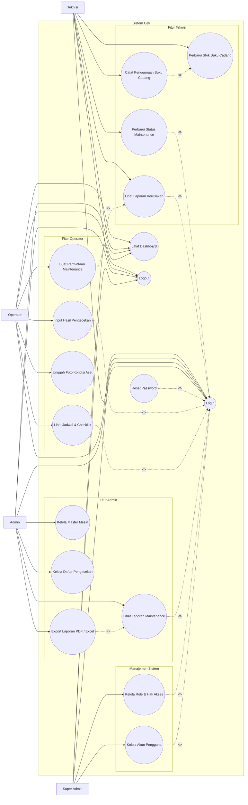

# Use Case Sistem

Dokumen ini berisi rancangan use case untuk Sistem Cek, yaitu sistem pengecekan, maintenance, manajemen mesin, suku cadang, audit, notifikasi, dan pelaporan. Use case disusun berdasarkan kebutuhan fungsional pada `KEBUTUHAN_FUNGSIONAL.md` dan struktur sistem pada `ERD_SISTEM.md`.

## Aktor

| Aktor | Peran |
| --- | --- |
| Super Admin | Mengelola seluruh sistem, termasuk pengguna, role, permission, master data, maintenance, suku cadang, laporan, dan konfigurasi akses. |
| Admin | Mengelola data operasional seperti master mesin, daftar pengecekan, maintenance, suku cadang, monitoring, dan laporan. |
| Operator | Melakukan pengecekan mesin/aset, melihat riwayat pengecekan, dan membuat permintaan maintenance jika diperlukan. |
| Teknisi | Menangani laporan atau permintaan maintenance, mencatat log perawatan, dan mencatat penggunaan suku cadang. |

Catatan: proses seperti pembuatan laporan maintenance otomatis, sinkronisasi status mesin, reminder penggantian, dan audit stok diperlakukan sebagai fungsi internal sistem, bukan aktor.

## Diagram Use Case

## Daftar Use Case

| Kode | Nama Use Case | Aktor Utama | Deskripsi Singkat |
| --- | --- | --- | --- |
| UC-001 | Login dan Logout | Super Admin, Admin, Operator, Teknisi | Pengguna masuk dan keluar dari sistem. |
| UC-002 | Kelola Pengguna | Super Admin, Admin | Mengelola data akun pengguna dan status pengguna. |
| UC-003 | Kelola Role dan Permission | Super Admin | Mengatur role dan hak akses menu/aksi. |
| UC-004 | Kelola Master Mesin | Super Admin, Admin | Mengelola data mesin/aset operasional. |
| UC-005 | Kelola Komponen Mesin | Super Admin, Admin | Mengelola komponen yang terpasang pada mesin. |
| UC-006 | Kelola Daftar Pengecekan | Super Admin, Admin | Mengelola checklist, standar, frekuensi, dan operator penanggung jawab. |
| UC-007 | Melakukan Pengecekan | Operator | Operator mengisi hasil pengecekan komponen. |
| UC-008 | Melihat Riwayat Pengecekan | Super Admin, Admin, Operator | Melihat data pengecekan yang sudah dilakukan. |
| UC-009 | Membuat Laporan Maintenance Otomatis | Tidak ada aktor eksternal | Sistem membuat laporan maintenance ketika ditemukan ketidaksesuaian. |
| UC-010 | Menangani Laporan Maintenance | Teknisi, Admin | Teknisi menangani laporan maintenance dari hasil pengecekan. |
| UC-011 | Membuat Permintaan Maintenance | Operator, Teknisi, Admin | Pengguna membuat request maintenance untuk mesin/komponen. |
| UC-012 | Mencatat Log Perawatan | Teknisi | Teknisi mencatat pekerjaan perawatan berdasarkan request maintenance. |
| UC-013 | Kelola Suku Cadang | Super Admin, Admin | Mengelola master data suku cadang dan kategori. |
| UC-014 | Catat Transaksi Stok | Super Admin, Admin, Teknisi | Mencatat transaksi stok masuk, keluar, retur, atau adjustment. |
| UC-015 | Lihat Audit Trail | Super Admin, Admin | Melihat riwayat aktivitas penting pada sistem. |
| UC-016 | Lihat Notifikasi | Super Admin, Admin, Operator, Teknisi | Pengguna melihat notifikasi sesuai kejadian dan perannya. |
| UC-017 | Lihat Dashboard Monitoring | Super Admin, Admin, Operator, Teknisi | Pengguna melihat ringkasan kondisi sistem. |
| UC-018 | Kelola dan Export Laporan | Super Admin, Admin | Pengguna melihat dan mengunduh laporan. |
| UC-019 | Sinkronisasi Status Mesin | Tidak ada aktor eksternal | Sistem menyesuaikan status mesin berdasarkan request aktif. |
| UC-020 | Kirim Reminder Penggantian | Tidak ada aktor eksternal | Sistem mengirim reminder penggantian mesin/komponen. |
| UC-021 | Audit Konsistensi Stok | Admin | Admin menjalankan atau meninjau audit konsistensi stok dan transaksi suku cadang. |

## Deskripsi Use Case

### UC-001 Login dan Logout

| Elemen | Deskripsi |
| --- | --- |
| Aktor | Super Admin, Admin, Operator, Teknisi |
| Tujuan | Pengguna dapat mengakses sistem sesuai akun dan hak aksesnya. |
| Prasyarat | Pengguna sudah memiliki akun aktif. |
| Alur Utama | Pengguna membuka halaman login, memasukkan email dan password, sistem memvalidasi kredensial, lalu sistem menampilkan dashboard sesuai hak akses. |
| Alur Alternatif | Jika kredensial salah, sistem menampilkan pesan gagal login. |
| Kondisi Akhir | Pengguna berhasil masuk atau keluar dari sistem. |

### UC-002 Kelola Pengguna

| Elemen | Deskripsi |
| --- | --- |
| Aktor | Super Admin, Admin |
| Tujuan | Mengelola data pengguna sistem. |
| Prasyarat | Aktor sudah login dan memiliki permission pengelolaan pengguna. |
| Alur Utama | Aktor membuka menu pengguna, menambah atau mengubah data pengguna, menentukan role dan status aktif, menyimpan data, lalu sistem memperbarui daftar pengguna. |
| Alur Alternatif | Jika email sudah digunakan atau data wajib kosong, sistem menolak penyimpanan dan menampilkan validasi. |
| Kondisi Akhir | Data pengguna tersimpan dan dapat digunakan sesuai role yang diberikan. |

### UC-003 Kelola Role dan Permission

| Elemen | Deskripsi |
| --- | --- |
| Aktor | Super Admin |
| Tujuan | Mengatur hak akses berdasarkan role pengguna. |
| Prasyarat | Aktor sudah login sebagai Super Admin. |
| Alur Utama | Aktor membuka menu role, membuat atau mengubah role, memilih permission, lalu menyimpan pengaturan akses. |
| Alur Alternatif | Jika role masih digunakan, penghapusan dapat dibatasi sesuai aturan sistem. |
| Kondisi Akhir | Role dan permission pengguna diperbarui. |

### UC-004 Kelola Master Mesin

| Elemen | Deskripsi |
| --- | --- |
| Aktor | Super Admin, Admin |
| Tujuan | Mengelola data mesin/aset operasional. |
| Prasyarat | Aktor memiliki permission untuk mengelola master mesin. |
| Alur Utama | Aktor membuka menu Master Mesin, menambah data mesin, mengisi identitas, status, penanggung jawab, data pengadaan, garansi, foto, dokumen pendukung, lalu menyimpan data. |
| Alur Alternatif | Jika kode mesin tidak unik atau data wajib kosong, sistem menampilkan pesan validasi. |
| Kondisi Akhir | Data mesin tersimpan dan dapat digunakan pada proses pengecekan atau maintenance. |

### UC-005 Kelola Komponen Mesin

| Elemen | Deskripsi |
| --- | --- |
| Aktor | Super Admin, Admin |
| Tujuan | Mengelola komponen yang terpasang pada mesin. |
| Prasyarat | Data mesin sudah tersedia. |
| Alur Utama | Aktor membuka detail atau form mesin, menambah komponen, mengisi nama komponen, part number, jadwal ganti, tanggal perawatan terakhir, status, spesifikasi, dan catatan. |
| Alur Alternatif | Jika jadwal ganti dan tanggal perawatan diisi, sistem menghitung estimasi tanggal penggantian berikutnya. |
| Kondisi Akhir | Komponen mesin tersimpan dan dapat dipantau jadwal penggantiannya. |

### UC-006 Kelola Daftar Pengecekan

| Elemen | Deskripsi |
| --- | --- |
| Aktor | Super Admin, Admin |
| Tujuan | Mengelola item dan komponen checklist pengecekan. |
| Prasyarat | Data operator tersedia. |
| Alur Utama | Aktor membuka menu Daftar Pengecekan, menambah daftar pengecekan, memilih operator penanggung jawab, mengisi deskripsi, menambah komponen checklist, standar, frekuensi, dan catatan. |
| Alur Alternatif | Jika operator sudah bertanggung jawab pada daftar pengecekan lain, sistem menolak pemilihan operator tersebut. |
| Kondisi Akhir | Daftar pengecekan siap digunakan operator. |

### UC-007 Melakukan Pengecekan

| Elemen | Deskripsi |
| --- | --- |
| Aktor | Operator |
| Tujuan | Mencatat hasil pengecekan mesin/aset. |
| Prasyarat | Operator sudah login dan memiliki daftar pengecekan yang menjadi tanggung jawabnya. |
| Alur Utama | Operator membuka menu Pengecekan, memilih daftar pengecekan yang belum dicek hari ini, sistem menampilkan komponen dan standar, operator mengisi status setiap komponen, mengisi keterangan jika tidak sesuai, lalu menyimpan pengecekan. |
| Alur Alternatif | Jika daftar pengecekan sudah dicek pada hari yang sama, sistem tidak menampilkan atau menolak pengecekan ulang. |
| Kondisi Akhir | Hasil pengecekan tersimpan sebagai riwayat. |

### UC-008 Melihat Riwayat Pengecekan

| Elemen | Deskripsi |
| --- | --- |
| Aktor | Super Admin, Admin, Operator |
| Tujuan | Melihat hasil pengecekan yang sudah dilakukan. |
| Prasyarat | Data pengecekan sudah tersedia. |
| Alur Utama | Aktor membuka menu pengecekan atau laporan, memilih filter tanggal/operator/status jika diperlukan, lalu sistem menampilkan daftar dan detail pengecekan. |
| Alur Alternatif | Jika data tidak tersedia pada filter yang dipilih, sistem menampilkan informasi data kosong. |
| Kondisi Akhir | Riwayat pengecekan dapat ditinjau. |

### UC-009 Membuat Laporan Maintenance Otomatis

| Elemen | Deskripsi |
| --- | --- |
| Aktor | Tidak ada aktor eksternal; dijalankan otomatis oleh sistem. |
| Tujuan | Membuat tindak lanjut maintenance ketika ditemukan ketidaksesuaian. |
| Prasyarat | Operator menyimpan hasil pengecekan dengan status komponen tidak sesuai. |
| Alur Utama | Sistem mendeteksi detail pengecekan tidak sesuai, memeriksa apakah laporan aktif untuk masalah tersebut sudah ada, membuat laporan maintenance berstatus pending, lalu mengirim notifikasi ke pengguna terkait. |
| Alur Alternatif | Jika laporan untuk masalah yang sama sudah ada, sistem tidak membuat laporan duplikat. |
| Kondisi Akhir | Laporan maintenance tersedia untuk ditangani teknisi. |

### UC-010 Menangani Laporan Maintenance

| Elemen | Deskripsi |
| --- | --- |
| Aktor | Teknisi, Admin |
| Tujuan | Menyelesaikan laporan maintenance dari hasil pengecekan. |
| Prasyarat | Laporan maintenance berstatus pending atau in progress tersedia. |
| Alur Utama | Teknisi membuka laporan, mengunggah foto sebelum, sistem mengubah status menjadi in progress, teknisi mengisi catatan dan suku cadang yang digunakan, teknisi mengunggah foto sesudah, lalu sistem mengubah status menjadi completed. |
| Alur Alternatif | Jika stok suku cadang tidak cukup, sistem menolak penggunaan suku cadang tersebut. |
| Kondisi Akhir | Laporan selesai, tanggal selesai tercatat, stok suku cadang berkurang, dan notifikasi dikirim. |

### UC-011 Membuat Permintaan Maintenance

| Elemen | Deskripsi |
| --- | --- |
| Aktor | Operator, Teknisi, Admin |
| Tujuan | Membuat permintaan maintenance terhadap mesin atau komponen. |
| Prasyarat | Data mesin tersedia. |
| Alur Utama | Aktor membuka menu Permintaan Maintenance, membuat request, memilih mesin dan komponen jika diperlukan, mengisi deskripsi masalah, tingkat urgensi, dan tanggal request, lalu menyimpan data. |
| Alur Alternatif | Jika data wajib belum lengkap, sistem menampilkan pesan validasi. |
| Kondisi Akhir | Request maintenance tersimpan, nomor request dibuat, status mesin disinkronkan, dan notifikasi dikirim. |

### UC-012 Mencatat Log Perawatan

| Elemen | Deskripsi |
| --- | --- |
| Aktor | Teknisi |
| Tujuan | Mencatat pekerjaan maintenance berdasarkan request. |
| Prasyarat | Request maintenance belum completed tersedia. |
| Alur Utama | Teknisi membuka menu Laporan Perawatan, memilih request, mengisi teknisi, tanggal mulai, tanggal selesai, status pekerjaan, foto sebelum, foto sesudah, catatan teknisi, dan suku cadang yang digunakan. |
| Alur Alternatif | Jika status completed dipilih, sistem memperbarui request menjadi completed dan membuat transaksi stok keluar. |
| Kondisi Akhir | Log perawatan tersimpan dan audit trail tercatat. |

### UC-013 Kelola Suku Cadang

| Elemen | Deskripsi |
| --- | --- |
| Aktor | Super Admin, Admin |
| Tujuan | Mengelola master data suku cadang. |
| Prasyarat | Aktor memiliki permission pengelolaan suku cadang. |
| Alur Utama | Aktor membuka menu Suku Cadang, menambah atau mengubah data kode, nama, kategori, stok, satuan, lokasi penyimpanan, harga, pemasok, garansi, status, dan foto. |
| Alur Alternatif | Jika kategori belum tersedia, aktor dapat membuat kategori baru dari form suku cadang. |
| Kondisi Akhir | Data suku cadang tersimpan dan dapat digunakan pada transaksi stok atau maintenance. |

### UC-014 Catat Transaksi Stok

| Elemen | Deskripsi |
| --- | --- |
| Aktor | Super Admin, Admin, Teknisi |
| Tujuan | Mencatat perubahan stok suku cadang. |
| Prasyarat | Data suku cadang tersedia. |
| Alur Utama | Aktor memilih suku cadang, memilih tipe transaksi, mengisi tanggal, jumlah, keterangan, dan dokumen pendukung jika ada, lalu sistem menghitung stok sebelum dan sesudah. |
| Alur Alternatif | Jika transaksi keluar melebihi stok tersedia, sistem menolak transaksi. |
| Kondisi Akhir | Transaksi stok tersimpan dan stok diperbarui sesuai approval/aturan sistem. |

### UC-015 Lihat Audit Trail

| Elemen | Deskripsi |
| --- | --- |
| Aktor | Super Admin, Admin |
| Tujuan | Melihat riwayat aktivitas penting untuk penelusuran. |
| Prasyarat | Audit trail sudah tercatat oleh sistem. |
| Alur Utama | Aktor membuka detail mesin atau data terkait, lalu sistem menampilkan aksi, user, waktu, deskripsi perubahan, data perubahan, IP address, dan user agent. |
| Alur Alternatif | Jika belum ada audit trail, sistem menampilkan data kosong. |
| Kondisi Akhir | Aktor dapat menelusuri aktivitas dan perubahan data. |

### UC-016 Lihat Notifikasi

| Elemen | Deskripsi |
| --- | --- |
| Aktor | Super Admin, Admin, Operator, Teknisi |
| Tujuan | Mengetahui kejadian penting pada sistem. |
| Prasyarat | Sistem sudah membuat notifikasi. |
| Alur Utama | Pengguna membuka ikon notifikasi, melihat daftar notifikasi, membaca pesan, lalu membuka link detail terkait jika diperlukan. |
| Alur Alternatif | Jika tidak ada notifikasi, sistem menampilkan informasi kosong. |
| Kondisi Akhir | Pengguna mengetahui dan dapat menindaklanjuti kejadian terkait. |

### UC-017 Lihat Dashboard Monitoring

| Elemen | Deskripsi |
| --- | --- |
| Aktor | Super Admin, Admin, Operator, Teknisi |
| Tujuan | Melihat ringkasan kondisi sistem. |
| Prasyarat | Pengguna sudah login. |
| Alur Utama | Pengguna membuka dashboard, lalu sistem menampilkan statistik mesin, status pengecekan, request maintenance, alert komponen, reminder operator/teknisi, tren maintenance, dan ringkasan stok. |
| Alur Alternatif | Tampilan dashboard dapat berbeda sesuai role dan permission. |
| Kondisi Akhir | Pengguna memperoleh gambaran kondisi operasional sistem. |

### UC-018 Kelola dan Export Laporan

| Elemen | Deskripsi |
| --- | --- |
| Aktor | Super Admin, Admin |
| Tujuan | Melihat dan mengunduh laporan sistem. |
| Prasyarat | Data laporan tersedia dan aktor memiliki hak akses. |
| Alur Utama | Aktor membuka menu laporan, memilih jenis laporan, mengatur filter periode atau data, menampilkan preview, lalu melakukan export PDF atau Excel. |
| Alur Alternatif | Jika data tidak tersedia pada periode yang dipilih, sistem menampilkan pesan tidak ada data. |
| Kondisi Akhir | Laporan dapat dilihat atau diunduh. |

### UC-019 Sinkronisasi Status Mesin

| Elemen | Deskripsi |
| --- | --- |
| Aktor | Tidak ada aktor eksternal; dijalankan otomatis oleh sistem. |
| Tujuan | Menyesuaikan status mesin berdasarkan request maintenance aktif. |
| Prasyarat | Terdapat data request maintenance. |
| Alur Utama | Sistem memeriksa request aktif pada setiap mesin, mengubah status mesin menjadi maintenance jika ada request aktif, dan mengembalikan status menjadi aktif jika tidak ada request aktif. |
| Alur Alternatif | Proses dapat dijalankan otomatis oleh scheduler atau manual melalui command oleh pengguna berwenang. |
| Kondisi Akhir | Status mesin sesuai kondisi request maintenance. |

### UC-020 Kirim Reminder Penggantian

| Elemen | Deskripsi |
| --- | --- |
| Aktor | Tidak ada aktor eksternal; dijalankan otomatis oleh sistem. |
| Tujuan | Memberi peringatan jadwal penggantian mesin atau komponen. |
| Prasyarat | Data umur ekonomis mesin atau jadwal ganti komponen tersedia. |
| Alur Utama | Sistem memeriksa mesin dan komponen yang mendekati atau melewati jadwal penggantian, membuat notifikasi, lalu mengirimkannya ke pengguna terkait. |
| Alur Alternatif | Rentang hari reminder dapat diatur melalui parameter command. |
| Kondisi Akhir | Pengguna terkait menerima reminder penggantian. |

### UC-021 Audit Konsistensi Stok

| Elemen | Deskripsi |
| --- | --- |
| Aktor | Admin |
| Tujuan | Memastikan stok suku cadang sesuai dengan histori transaksi. |
| Prasyarat | Data suku cadang dan transaksi stok tersedia. |
| Alur Utama | Sistem memeriksa histori transaksi, membandingkan stok tercatat dengan stok hasil perhitungan transaksi, lalu menampilkan hasil audit. |
| Alur Alternatif | Jika ditemukan ketidaksesuaian, Admin dapat menjalankan opsi perbaikan sesuai command yang tersedia. |
| Kondisi Akhir | Konsistensi stok dapat diverifikasi atau diperbaiki. |

## Relasi Include dan Extend

| Use Case Asal | Relasi | Use Case Tujuan | Keterangan |
| --- | --- | --- | --- |
| UC-007 Melakukan Pengecekan | extend | UC-009 Membuat Laporan Maintenance Otomatis | Terjadi jika ada komponen berstatus tidak sesuai. |
| UC-010 Menangani Laporan Maintenance | include | UC-014 Catat Transaksi Stok | Terjadi saat teknisi menggunakan suku cadang. |
| UC-011 Membuat Permintaan Maintenance | include | UC-019 Sinkronisasi Status Mesin | Status mesin disesuaikan setelah request dibuat/diperbarui. |
| UC-012 Mencatat Log Perawatan | include | UC-014 Catat Transaksi Stok | Terjadi saat log memakai suku cadang. |
| UC-012 Mencatat Log Perawatan | include | UC-015 Lihat Audit Trail | Aktivitas teknisi dicatat sebagai audit trail. |
| UC-013 Kelola Suku Cadang | include | UC-014 Catat Transaksi Stok | Perubahan stok dilakukan melalui transaksi. |
| UC-020 Kirim Reminder Penggantian | include | UC-016 Lihat Notifikasi | Reminder dikirim sebagai notifikasi pengguna. |
